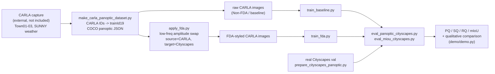
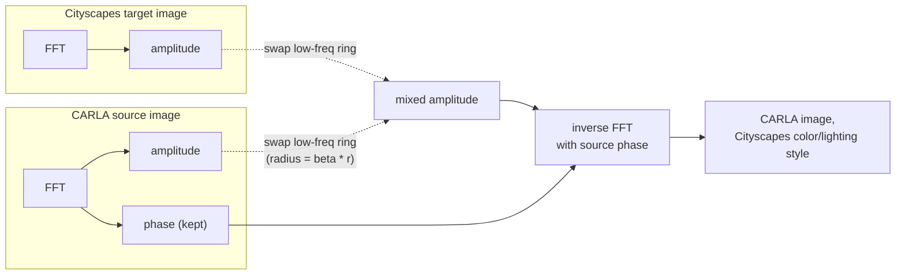

# Synthetic-to-Real Domain Adaptation for Panoptic Segmentation: An FDA-Enhanced Mask2Former Analysis

Code accompanying the bachelor's thesis submitted to the AI Convergence
Division, College of IT, Soongsil University (2025-12-05):

> **Synthetic-to-Real Domain Adaptation for Panoptic Segmentation: An
> FDA-Enhanced Mask2Former Analysis**
> Bonghun Hong (AI Convergence Division, Soongsil University)
> Advisor: Prof. Sungheum Kim

## Overview

Training panoptic segmentation models on real driving data is expensive and
hard to diversify (rare weather, dangerous scenarios). Simulators like CARLA
offer cheap, unlimited synthetic data instead — but a model trained purely on
synthetic imagery generalizes poorly to the real world because of the
**Synthetic-to-Real domain gap**: color, lighting, texture and noise
statistics differ from real photographs even when scene geometry is similar.

This project trains [Mask2Former](https://github.com/facebookresearch/Mask2Former)
(Swin-Large backbone) for panoptic segmentation purely on CARLA-simulated
driving images, evaluates it on **real Cityscapes** validation data, and
measures how much of that domain gap can be closed with
**[Fourier Domain Adaptation (FDA)](https://arxiv.org/abs/2004.05498)** — a
training-free technique that swaps the low-frequency Fourier amplitude of a
source (CARLA) image for a target (Cityscapes) image's amplitude while
keeping the source's phase, transferring color/lighting style without
touching scene structure or the label maps.

**Result summary** (Cityscapes-val, see [Evaluation](#evaluation-1) for the
full tables): a model trained only on raw CARLA data suffers a ~28-point PQ
drop relative to a real-data baseline; applying FDA to the CARLA training
images before training recovers part of that gap (+4.9 PQ, +2.4 mIoU) without
touching the labels or the model architecture — but a large gap remains,
showing that appearance-level adaptation alone cannot fully close a
structural sim-to-real gap for a task as demanding as panoptic segmentation.

## Pipeline



FDA in one picture (source phase preserved, only the low-frequency amplitude
ring is swapped for the target's):



## Repository structure

```
configs/                       Mask2Former Swin-L panoptic config chain (Cityscapes)
mask2former/                   vendored Mask2Former model/framework code (unmodified)
demo/                          single-image inference + visualization (demo.py)
tools/                         Swin-L ImageNet-21k backbone weight converter, etc.
scripts/
  data_prep/
    carla_label_mapping.py       CARLA raw-ID -> Cityscapes trainId19 tables
    make_carla_panoptic_dataset.py   CARLA capture -> COCO panoptic dataset
    prepare_cityscapes_panoptic.py   real Cityscapes gtFine -> panoptic trainId JSON/PNGs
    cityscapes_labelIds_to_trainIds.py   real Cityscapes labelId -> trainId semantic PNGs
  fda/
    apply_fda.py                 FDA batch transform (see note below — reconstructed)
  register_datasets.py           Detectron2 dataset registration (CARLA train/val, raw or FDA)
  train_baseline.py              Mask2Former training, raw CARLA (Non-FDA)
  train_fda.py                   Mask2Former training, FDA-styled CARLA
  eval/
    eval_panoptic_cityscapes.py    PQ/SQ/RQ on real Cityscapes val (primary eval)
    eval_miou_cityscapes.py        mIoU on real Cityscapes val (see note below — reconstructed)
    eval_panoptic_from_saved_preds.py   alternative: evaluate from already-saved prediction PNGs/JSONs
    eval_instance_ap.py            supplementary: COCO-style instance AP
  inference/
    viz_pred_vs_gt.py              side-by-side GT-vs-prediction panoptic PNG stitcher
```

## Setup

```bash
git clone <this repo>
cd <this repo>
pip install -r requirements.txt

# Detectron2 and panopticapi from source (see INSTALL.md for full details):
python -m pip install 'git+https://github.com/facebookresearch/detectron2.git'
python -m pip install 'git+https://github.com/cocodataset/panopticapi.git'

# Compile Mask2Former's CUDA ops (multi-scale deformable attention):
cd mask2former/modeling/pixel_decoder/ops && sh make.sh && cd -

# Convert the ImageNet-21k Swin-Large pretrained backbone to Detectron2 format:
python tools/convert-pretrained-swin-model-to-d2.py swin_large_patch4_window12_384_22k.pth swin_large_patch4_window12_384_22k.pkl
```

## Data preparation

1. **CARLA capture** (not included in this repo — the raw simulator capture
   loop was not recovered; regenerate it with CARLA's PythonAPI following the
   parameters described in the thesis §III-2: CARLA 0.9.15, Town01–Town03,
   `SUNNY_GLARE_DAY` weather only, FOV 90°, 2048×1024 resolution, saving
   per-frame RGB / semantic-label / panoptic-ID PNGs).
2. **Pack into a COCO panoptic dataset**:
   ```bash
   python scripts/data_prep/make_carla_panoptic_dataset.py \
       --in-root /path/to/raw_carla_capture \
       --out-root /path/to/final_dataset \
       --train-towns Town01 Town02 --val-towns Town03 \
       --scenarios SUNNY_GLARE_DAY
   ```
   This is the split actually used for the thesis: every SUNNY frame from
   Town01+Town02 as train (~3,000 images), all of Town03 as val (~500
   images), 19 Cityscapes trainId classes.
3. **Prepare real Cityscapes** (for evaluation): convert the official
   `gtFine`/`leftImg8bit` download into trainId semantic PNGs and a panoptic
   trainId JSON:
   ```bash
   python scripts/data_prep/cityscapes_labelIds_to_trainIds.py --splits train val
   python scripts/data_prep/prepare_cityscapes_panoptic.py --help  # see script for exact args
   ```

## FDA transform

```bash
python scripts/fda/apply_fda.py \
    --src-root /path/to/final_dataset/leftImg8bit/train \
    --cityscapes-root /path/to/cityscapes/leftImg8bit/train \
    --dst-root /path/to/final_dataset/leftImg8bit_fda/train \
    --beta 0.002 --num-workers 12
```
Repeat for the `val` split. Only the RGB pixels change — panoptic/semantic
label files are reused unmodified for both the raw and FDA-styled datasets.

FDA decomposes an image via 2D FFT into amplitude (color/lighting/tone) and
phase (structure/edges/geometry). It replaces the source image's amplitude
with the target's *only* inside a low-frequency disk of radius `beta * r`
around the zero frequency, keeps the source's phase untouched, and inverts
the FFT — producing an image with CARLA's geometry but Cityscapes' color
statistics. The thesis tried `beta` in `{0.05, 0.01, 0.002}` and reports
`beta = 0.002` as the most stable setting.

> **Note on reconstruction:** the FDA math (`fda_amplitude_swap`) is kept
> verbatim from the original experiment script and correctly implements the
> paper's equations. The full-dataset *run* that produced the actual training
> data (3,000+ images at `beta=0.002`) was not recoverable — the surviving
> original script only ever ran a 10-image smoke test. `apply_fda.py` above
> is a generalized, cleaned-up CLI reconstruction of that same logic, meant
> to reproduce the full run.

## Training

| Hyperparameter | Value |
|---|---|
| Backbone | Swin-Large, ImageNet-21k, 384 pretrain |
| Train crop size | 512 × 1024 |
| Test resolution | 1024 × 2048 |
| Batch size | 2 |
| Optimizer | AdamW, weight decay 0.05, backbone LR multiplier 0.1 |
| Base LR | 1e-4 |
| LR scheduler | WarmupPolyLR |
| Max iterations | 50,000 |
| Loss | Mask2Former panoptic loss (mask + class + dice) |
| Data augmentation | RandomCrop + HorizontalFlip only |

```bash
# Baseline (Non-FDA)
CARLA_DATASET_ROOT=/path/to/final_dataset \
OUTPUT_DIR=./output/train_baseline \
python scripts/train_baseline.py \
    --config-file configs/cityscapes/panoptic-segmentation/swin/maskformer2_swin_large_IN21k_384_bs16_90k.yaml \
    --num-gpus 1 \
    MODEL.WEIGHTS swin_large_patch4_window12_384_22k.pkl \
    SOLVER.MAX_ITER 50000 SOLVER.IMS_PER_BATCH 2

# FDA (requires leftImg8bit_fda/ under CARLA_DATASET_ROOT, see above)
CARLA_DATASET_ROOT=/path/to/final_dataset \
OUTPUT_DIR=./output/train_fda \
python scripts/train_fda.py \
    --config-file configs/cityscapes/panoptic-segmentation/swin/maskformer2_swin_large_IN21k_384_bs16_90k.yaml \
    --num-gpus 1 \
    MODEL.WEIGHTS swin_large_patch4_window12_384_22k.pkl \
    SOLVER.MAX_ITER 50000 SOLVER.IMS_PER_BATCH 2
```

> The stock config file defaults to `MAX_ITER=600000` / `IMS_PER_BATCH=16`
> (its original ADE20K/COCO-scale settings) — the `--opts` above override
> them to match the thesis's Table 3.1. The exact original invocation
> wasn't recoverable from any surviving log, so these flags reproduce the
> documented hyperparameters rather than being a literal replay of a
> captured command.

## Evaluation

```bash
python scripts/eval/eval_panoptic_cityscapes.py \
    --config-file configs/cityscapes/panoptic-segmentation/swin/maskformer2_swin_large_IN21k_384_bs16_90k.yaml \
    --weights ./output/train_fda/model_final.pth \
    --output ./output/eval_fda

python scripts/eval/eval_miou_cityscapes.py \
    --config-file configs/cityscapes/panoptic-segmentation/swin/maskformer2_swin_large_IN21k_384_bs16_90k.yaml \
    --weights ./output/train_fda/model_final.pth \
    --cityscapes-root /path/to/cityscapes --output ./output/eval_fda
```

> **Note on reconstruction:** `eval_panoptic_cityscapes.py` is a real,
> complete script found in the project (only lightly cleaned up here). No
> single surviving script computed mIoU against real Cityscapes val, though —
> the confusion-matrix mIoU routine that *was* found was wired to a different,
> CARLA-internal side-experiment. `eval_miou_cityscapes.py` re-targets that
> same "COCOPanopticEvaluator for PQ/SQ/RQ, a separate routine for mIoU"
> design — documented in the project's own WildDash2 eval variant — at real
> Cityscapes val instead.

### Results (Cityscapes-val)

**Non-FDA vs. a real-data baseline** — training purely on raw CARLA and
testing on real Cityscapes:

| Model | PQ | SQ | RQ | PQ_th | SQ_th | RQ_th | PQ_st | SQ_st | RQ_st | mIoU |
|---|---|---|---|---|---|---|---|---|---|---|
| Real-data baseline | 45.92 | 76.01 | 58.27 | 36.24 | 73.71 | 48.54 | 56.69 | 78.57 | 69.08 | 77.07 |
| CARLA (Non-FDA) | 18.20 | 56.86 | 23.75 | 3.99 | 56.42 | 6.17 | 33.98 | 57.36 | 43.28 | 43.28 |
| Δ vs. baseline | −27.72 | −19.15 | −34.52 | −32.25 | −17.29 | −42.37 | −22.71 | −21.21 | −25.80 | −33.79 |

**Effect of FDA** — same CARLA training set, with vs. without FDA:

| Model | PQ | SQ | RQ | PQ_th | SQ_th | RQ_th | PQ_st | SQ_st | RQ_st | mIoU |
|---|---|---|---|---|---|---|---|---|---|---|
| CARLA (Non-FDA) | 18.20 | 56.86 | 23.75 | 3.99 | 56.42 | 6.17 | 33.98 | 57.36 | 43.28 | 43.28 |
| CARLA + FDA | 23.08 | 63.17 | 28.55 | 4.81 | 58.68 | 7.30 | 43.37 | 68.16 | 52.16 | 45.71 |
| Δ | +4.88 | +6.31 | +4.80 | +0.82 | +2.26 | +1.13 | +9.39 | +10.80 | +8.88 | +2.43 |

FDA improves every metric — most visibly the "stuff" columns (PQ_st +9.4,
SQ_st +10.8) — but the thing-class numbers (small cars/people/etc.) stay very
low, and the overall PQ is still far below the real-data baseline. See the
thesis §IV-3 for the full discussion.

## Inference / qualitative comparison

```bash
python demo/demo.py \
    --config-file configs/cityscapes/panoptic-segmentation/swin/maskformer2_swin_large_IN21k_384_bs16_90k.yaml \
    --input /path/to/a/cityscapes/image.png \
    --output /path/to/out.png \
    --opts MODEL.WEIGHTS ./output/train_baseline/model_final.pth
```
Run once with the baseline checkpoint and once with the FDA checkpoint on the
same real Cityscapes image to reproduce the qualitative Non-FDA-vs-FDA
comparison from the thesis (Fig. 4.1–4.3). `scripts/inference/viz_pred_vs_gt.py`
is a supplementary tool for stitching a saved prediction panoptic PNG next to
its ground truth.

## Known limitations / what's not included

- **The dataset is not included** — it was deleted after the thesis was
  submitted and is not redistributed here; regenerate it via the CARLA
  capture step above.
- **The raw CARLA capture script** (drives the simulated vehicle and dumps
  per-frame RGB/semantic/panoptic PNGs) was not recovered from the project
  files and is not included; only the downstream packaging step
  (`make_carla_panoptic_dataset.py`) survived.
- **Two scripts are reconstructions**, not literal surviving originals —
  `scripts/fda/apply_fda.py` (full-dataset FDA batch run) and
  `scripts/eval/eval_miou_cityscapes.py` (Cityscapes-val mIoU) — both are
  clearly marked as such in their own header comments and built from the
  closest verified logic that *was* found in the project.
- Trained model checkpoints are not included (also lost with the dataset).

## Citation

```bibtex
@mastersthesis{hong2025fda,
  title  = {Synthetic-to-Real Domain Adaptation for Panoptic Segmentation: An FDA-Enhanced Mask2Former Analysis},
  author = {Hong, Bonghun},
  school = {Soongsil University, AI Convergence Division},
  year   = {2025},
  month  = {12},
  note   = {Advisor: Sungheum Kim}
}
```

## License

This repository builds on [facebookresearch/Mask2Former](https://github.com/facebookresearch/Mask2Former)
and [facebookresearch/detectron2](https://github.com/facebookresearch/detectron2).
See `LICENSE` for Mask2Former's license terms (portions of the underlying
Swin-Transformer and Deformable-DETR code carry their own licenses — see the
notice at the bottom of `LICENSE`).
